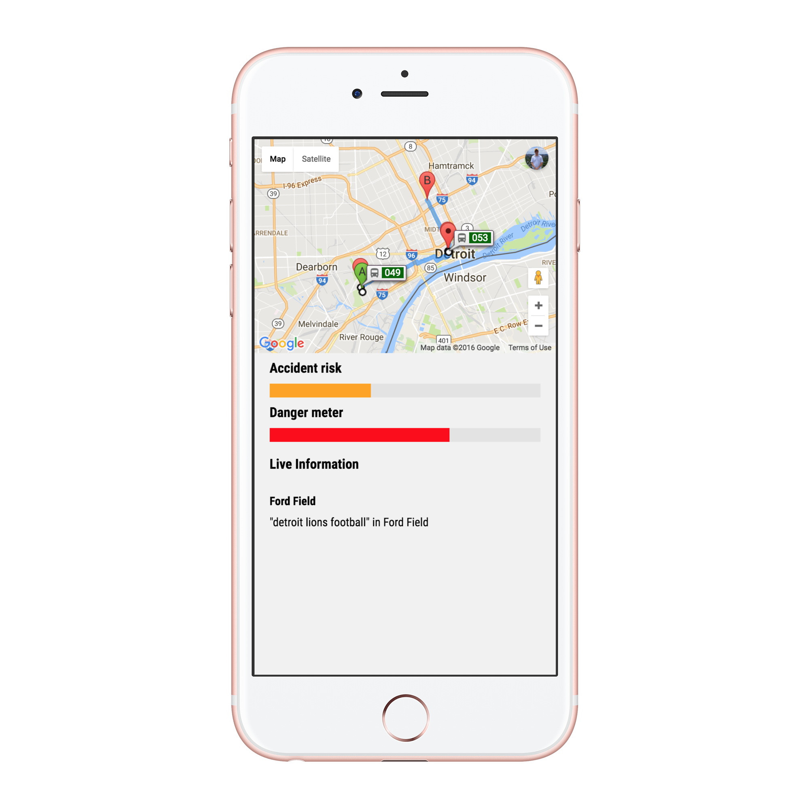
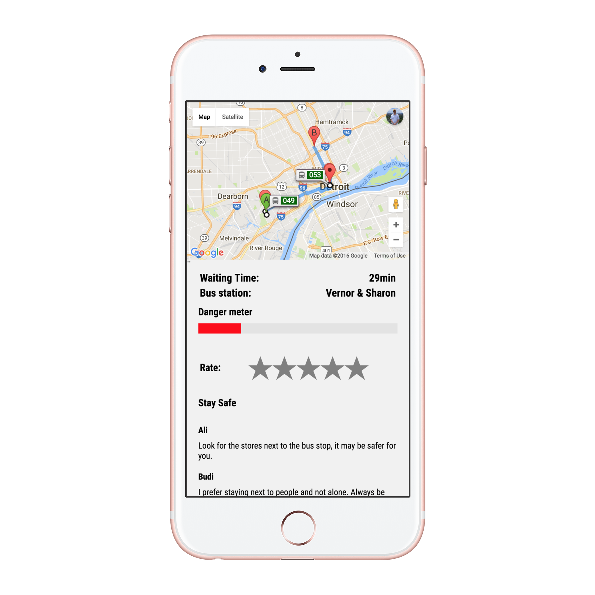
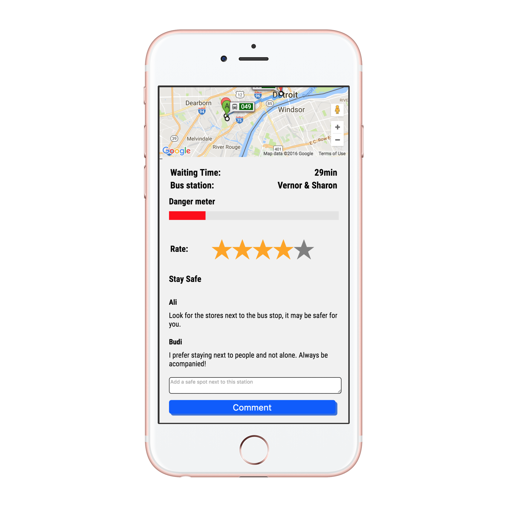
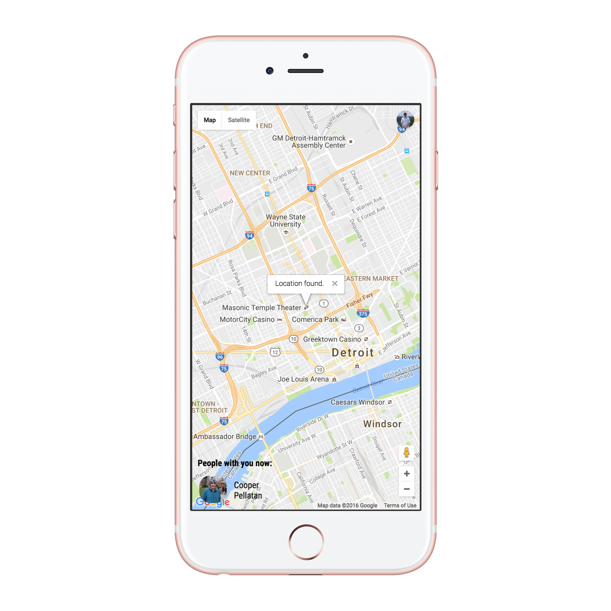

# !Safe
A product of [MHacks 8](https://mhacks.org/).

By Ali Behlalah, Budi Ryan, Aaron Hsu and Cooper Pellaton

## Table of Contents
- [Overview](#overview)
- [Explanation](#explanation)
- [Getting Started](#getting-started)
- [API](#api)

## Overview
We were posed a problem by both Ford and Devpost, that the city of Detroit is not currently safe to travel in for many of it's residents, and that there is a potential to enable better transit through technology, but it doesn't currently exist. Taking this to mind as well as the data sets that were [provided](http://mhacks8.devpost.com/details/ford) to us, we created an application to solve this problem.

Welcome *!Safe*, a platform to best help you get from Point A --> Point B in the city of Detroit.

View the following screenshots of the application in action:

See the the route in the context of private transportation:

See the route in the context of public transportation:

Share your location with your loved ones so they can be alerted if your danger/risk ration changes:

## Explanation
Detroit is not a safe city, we all know this, so we began by writing some ML models to help calculate the apparent risk and danger associated with travelling along a certain route. These models are composed with a number of data sets, but at the highest level we mix user related stastics with city crime data, weather data, traffic data, etc. to determine what the potential downsides of travelling amongst a certain path are.

To effecitvely serve the user, when they input a source and destination in our application we run a probability of this inforamtion through our model and then use this to inform how we will suggest the user to travel. For instance, if there is a significantly high likelihood of crime occuring on a certain street, yet that is the route suggested by Google Maps, we will deviate and reroute the user so that their safety is guaranteed.

Furthermore, we support a myriad of travel types including Public and Non-Public transport. This means that we can tell you how late your Detroit, public-run, bus will be and then suggest to you a safe place to wait just as well as we can suggest to you the safest & most efficient way to bike || walk || drive through Detroit.

## Getting Started
We've included all the code that you should need to be able to run this application for yourself in this repository. To begin, start by cloning this repository and then `cd` to it.

Run `npm install && nodemon app.js`. You now have our server running and can access the application on `localhost:3000`. If you want you can try to send some queries to our APIs using Postman. See the section below on the APIs and the sample data you can get in and out.

The rest should be pretty self-explanatory. If you're reading this you know how something like this would work. Just read through [app.js](app.js) where the core of the application is defined.

## API
If the type is `POST` you are expected to provide `x-www-form-urlencoded` data in a JSON blob. If the type is `GET` then obviously, you don't need to do anyting :smile:.

**POST**

- /api/doSomeML
	- This runs the ML models on the given inputs. 
	- A sample of what tt expects for you to provide the following in the `POST` body is shown:
	`{visibility: 3.9793469387755103, lat: 42.3422975, long: -83.0591982}`
	
- /api/nextBus
	- This determines whether the location you are at is a valid stop and, if it is, will tell you when the next bus is arriving.
	- Sample `POST` body:
	`[[lat, long], [lat, long]]`
- /api/orderUber
	- This route will order an UBER to the coordinates given and prepopulate the destination field.
	- Sample `POST` body:
	`{[LAT, LONG],[LAT, LONG]}`
- /api/putRate
	- This route allows one to submit a rating of a stop. Ratings are an integer 1-5 inclusive.
	- Sample `POST` body:
	`["lng": NUMBER, "lat": NUMBER, "rate": NUMBER]` 
- /api/putComment
	- This route allows one to submit a comment regarding a stop. Comments can be any string.
	- Sample `POST` body:
	`["lng": NUMBER, "lat": NUMBER, "comment": STRING]`
- /api/trafficData

**GET**

- /api/getComment
	- This gets a random comment from the database.
- api/getRate
	- This returns the average rating of the query parameter.

